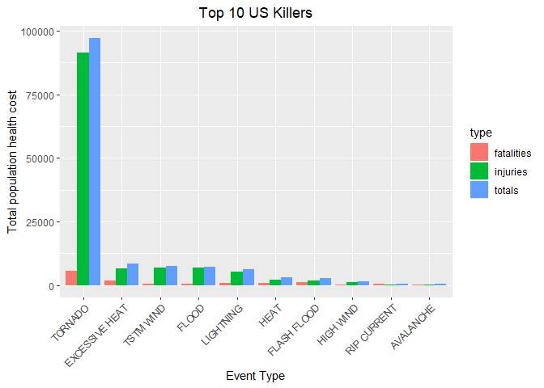
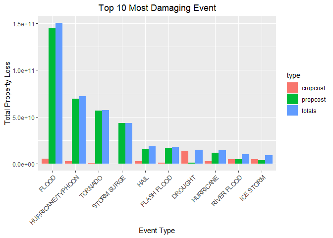

# 1. Summary

This project involves exploring the U.S. National Oceanic and Atmospheric Administration's (NOAA) storm database. This database tracks characteristics of major storms and weather events in the United States, including when and where they occur, as well as estimates of any fatalities, injuries, and property damage.The events in the database start in the year 1950 and end in November 2011. 

Details about the data can be found [here][https://d396qusza40orc.cloudfront.net/repdata%2Fpeer2_doc%2Fpd01016005curr.pdf]


In the following analysis, we focus on two queations:

1. Across the United States, which types of events are most harmful with respect to population health?

2. Across the United States, which types of events have the greatest economic consequences?

## 2. Data Processing

### 2.1 load data


```r
# fileUrl = "https://d396qusza40orc.cloudfront.net/repdata%2Fdata%2FStormData.csv.bz2"

# download.file(fileUrl,destfile = "./data/stormdata.csv.bz2")

stormdf = read.csv("./data/stormdata.csv.bz2") %>% janitor::clean_names()

# convert df to dt
stormdt = as.data.table(stormdf)
```


### 2.2 Data subsetting and processing

We select variables related to population health and economic consequences.


```r
workdt = stormdt[,.(evtype,fatalities,injuries,
                   propdmg,propdmgexp,cropdmg,cropdmgexp)]

# remove rows with undifined event type and zaro damage
workdt = workdt[(evtype != "?" & 
             (injuries > 0 | fatalities > 0 | propdmg> 0 | cropdmg > 0))]

#  Converting Exponent Columns into Actual Exponents 
cols = c("propdmgexp", "cropdmgexp")
workdt[,  (cols) := c(lapply(.SD, toupper)), .SDcols = cols]

propdmgKey =  c("\"\"" = 10^0,"-" = 10^0, "+" = 10^0,"0" = 10^0,"1" = 10^1,"2" = 10^2,
                 "3" = 10^3, "4" = 10^4,"5" = 10^5,"6" = 10^6,"7" = 10^7,"8" = 10^8,
                 "9" = 10^9,"H" = 10^2,"K" = 10^3,"M" = 10^6,"B" = 10^9)

cropdmgKey =  c("\"\"" = 10^0,"?" = 10^0, "0" = 10^0,
                "K" = 10^3,"M" = 10^6,"B" = 10^9)
  
workdt[,propdmgexp := propdmgKey[as.character(workdt[,propdmgexp])]]
workdt[is.na(propdmgexp), propdmgexp := 10^0 ]

workdt[,cropdmgexp := cropdmgKey[as.character(workdt[,cropdmgexp])]]
workdt[is.na(cropdmgexp), cropdmgexp := 10^0 ]
```

### 2.3 Analyses regarding population health


```r
# summary(workdt[,fatalities])
# plot(workdt[,evtype],workdt[,fatalities])

# sum by event type
health = workdt[, .(fatalities = sum(fatalities), injuries = sum(injuries), 
                  totals = sum(fatalities) + sum(injuries)), by = .(evtype)]

health = health[order(-fatalities),]

health_top = head(health[,.(evtype,fatalities,injuries,totals)],10)
```

### 2.4 Analyses regarding economic consequences


```r
# dmg * exp = true cost
money = workdt[,.(evtype, propdmg,propdmgexp,propcost = propdmg * propdmgexp, 
                  cropdmg,cropdmgexp,cropcost = cropdmg * cropdmgexp )]

# sum by event type
moneytotal = money[,.(propcost = sum(propcost),
                      cropcost = sum(cropcost),
                      totals = sum(propcost) + sum(cropcost)),
                      by = .(evtype)]

moneytotal = moneytotal[order(-totals),]

moneytotal_top = head(moneytotal[,.(evtype,propcost,cropcost,totals)],10)
```


## 3. Result 

**1. Across the United States, which types of events are most harmful with respect to population health?**

Tornado is the event that causes most fatalities and injuries. 


```r
health_top
```

```
##             evtype fatalities injuries totals
##  1:        TORNADO       5633    91346  96979
##  2: EXCESSIVE HEAT       1903     6525   8428
##  3:    FLASH FLOOD        978     1777   2755
##  4:           HEAT        937     2100   3037
##  5:      LIGHTNING        816     5230   6046
##  6:      TSTM WIND        504     6957   7461
##  7:          FLOOD        470     6789   7259
##  8:    RIP CURRENT        368      232    600
##  9:      HIGH WIND        248     1137   1385
## 10:      AVALANCHE        224      170    394
```

```r
health_topdt = as.data.frame(health_top)

health_topdt = pivot_longer(health_topdt,
            fatalities:totals,
            names_to = "type",
            values_to = "value")


ggplot(health_topdt, aes(x =reorder(evtype, -value) , y=value)) + 
  geom_bar(stat = "identity", aes(fill=type),position="dodge")  +
  labs(y = "Total population health cost" , x = "Event Type")+
  theme(axis.text.x = element_text(angle=45, hjust=1))+
  ggtitle("Top 10 US Killers") +
  theme(plot.title = element_text(hjust = 0.5))
```

<!-- -->


**2. Across the United States, which types of events have the greatest economic consequences?**

Tornado have the greatest economic consequences. 


```r
moneytotal_top
```

```
##                evtype     propcost    cropcost       totals
##  1:             FLOOD 144657709807  5661968450 150319678257
##  2: HURRICANE/TYPHOON  69305840000  2607872800  71913712800
##  3:           TORNADO  56947380677   414953270  57362333947
##  4:       STORM SURGE  43323536000        5000  43323541000
##  5:              HAIL  15735267513  3025954473  18761221986
##  6:       FLASH FLOOD  16822673979  1421317100  18243991079
##  7:           DROUGHT   1046106000 13972566000  15018672000
##  8:         HURRICANE  11868319010  2741910000  14610229010
##  9:       RIVER FLOOD   5118945500  5029459000  10148404500
## 10:         ICE STORM   3944927860  5022113500   8967041360
```

```r
moneytotal_topdt = as.data.frame(moneytotal_top)

moneytotal_topdt = pivot_longer(moneytotal_topdt,
            propcost:totals,
            names_to = "type",
            values_to = "value")


ggplot(moneytotal_topdt, aes(x =reorder(evtype, -value) , y=value)) + 
  geom_bar(stat = "identity", aes(fill=type),position="dodge")  +
  labs(y = "Total Property Loss" , x = "Event Type")+
  theme(axis.text.x = element_text(angle=45, hjust=1))+
  ggtitle("Top 10 Most Damaging Event") +
  theme(plot.title = element_text(hjust = 0.5))
```

<!-- -->

